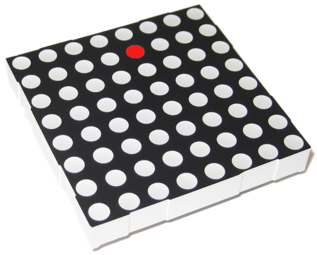
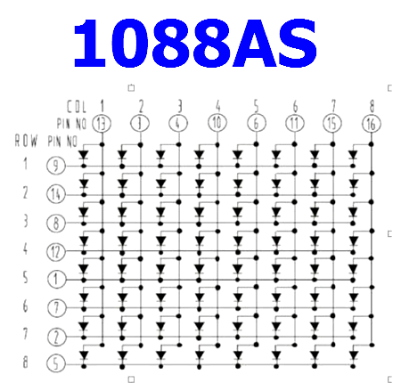

********************************************************************************

{ .float-right }

## Benodigdheden

- 1 Arduino (UNO)+USB
- 2 Breadboards
- 1 8x8 LED Matrix
- 1 Joystick
- 8 1kΩ weerstanden
- Many jump wires

********************************************************************************

::: read

*Introductie*

In deze opdracht ga je werken met een led matrix. Dit is een scherm waarin 64
led-lampjes zitten en waarmee je allerlei leuke patronen kan maken. In deze
opdracht gaan we een led-lampje besturen met een joystick.

:::

________________________________________________________________________________

::: read

{ .float-right }
{ .float-right }

*Uitleg werking LED matrix*

In een LED-matrix zijn de LEDs opgesteld in rijen en kolommen. Alle Anode pins
van de leds zijn verbonden met de anode pins van de andere leds in dezelfde rij.
Ale kathode pins van de leds zijn verbonden met de kathode pins van de andere
leds in dezelfde kolom. De aansluitpennetjes op de LED-matrix zijn verbonden
met de rijen en kolommen.

Hiernaast kan je zien hoe een LED-matrix er vanbinnen uitziet. Ook kan je zien
welke pins worden gebruikt om de rijen en de kolommen te besturen.

Bijvoorbeeld de pin C8 links boven is voor kolom 1. De pin R5 links onder is
voor rij 5.

*clear-float*
:::

________________________________________________________________________________
*pagebreak*

::: read

*Uitleg LED matrix*

Je kan een LED aanzetten door een kolom **HIGH** te maken en een rij **LOW** te
maken. Er gaat dan stroom lopen van **HIGH** naar **LOW**. De LED op het
kruispunt van de rij en de kolom gaat dan aan.

Op deze manier kunnen de 64 LEDs met slechts 16 aansluitingen worden bestuurd.

:::

________________________________________________________________________________
*pagebreak*

::: build
{.float-right}

*Bouwen van de elektronica*

Maak het volgende schema na. Vraag aan een mentor om te helpen met het uitzoeken
van alle spullen die je nodig hebt.

*clear-float*

:::

________________________________________________________________________________
*pagebreak*

::: build
{.float-right}

*Bouwen van de elektronica*

Maak het volgende schema na. Vraag aan een mentor om te helpen met het uitzoeken
van alle spullen die je nodig hebt.

*clear-float*
:::

________________________________________________________________________________
*pagebreak*

:::: program

*Aanroepen van **updateDisplay()** functie*

::: codeblock

<<<src/led-matrix1/led-matrix1.ino#snippet

```c

void setup() {
// !!!!!!!!!!!!!!!!!!!!!!!!!!!!!!!!!!!!!!!!!!!!!!!!!!!!!!!!!!!!
// Voeg hier code toe om de updateDisplay functie aan te roepen
// !!!!!!!!!!!!!!!!!!!!!!!!!!!!!!!!!!!!!!!!!!!!!!!!!!!!!!!!!!!!
}
```

:::
::::

________________________________________________________________________________

<!-- @include: global-lib/explain-mod.md#arduino -->

________________________________________________________________________________

::: challenge
*Uitdaging*

Probeer eens om .......
:::

________________________________________________________________________________

::: challenge
*Uitdaging*

Probeer eens om .......
:::

________________________________________________________________________________

[font awesome](https://fontawesome.com/search?ic=free-collection){target=_blank}

*separator1*
