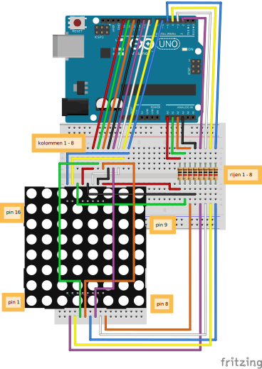

********************************************************************************

{ .float-right }

## Benodigdheden

- 1 Arduino (UNO)+USB
- 2 Breadboards
- 1 8x8 LED Matrix
- 1 Joystick
- 8 1kΩ weerstanden
- Many jump wires

********************************************************************************

::: read

*Introductie*

In deze opdracht ga je werken met een led matrix. Dit is een scherm waarin 64
led-lampjes zitten en waarmee je allerlei leuke patronen kan maken. In deze
opdracht gaan we een led-lampje besturen met een joystick.

:::

________________________________________________________________________________
*pagebreak*
::: read

{.float-right}
{.float-right}

*Uitleg werking LED matrix*

In een LED-matrix zijn de LEDs opgesteld in rijen en kolommen. Alle anode pins
van de leds zijn verbonden met de anode pins van de andere leds in dezelfde rij.
Ale kathode pins van de leds zijn verbonden met de kathode pins van de andere
leds in dezelfde kolom. De aansluitpinnen op de LED-matrix zijn verbonden
met de rijen en kolommen.

Hiernaast kan je zien hoe een LED-matrix er vanbinnen uitziet. Ook kan je zien
welke pins worden gebruikt om de rijen en de kolommen te besturen.

Bijvoorbeeld de pin 16 (C8) links boven is voor kolom 8. De pin 1 (R5)
links onder is voor rij 5.

Je kan een LED aanzetten door een kolom **HIGH** te maken en een rij **LOW** te
maken. Er gaat dan stroom lopen van **HIGH** naar **LOW**. De LED op het
kruispunt van de rij en de kolom gaat dan aan.

Op deze manier kunnen de 64 LEDs met slechts 16 aansluitingen worden bestuurd.

:::

________________________________________________________________________________
*pagebreak*

::: build

{.float-right}

*Bouwen van de elektronica*

Maak het volgende schema na. Vraag aan een mentor om te helpen met het uitzoeken
van alle spullen die je nodig hebt.

:::

________________________________________________________________________________
*pagebreak*

:::: program

*Maken van pin-lijsten*

In de code hieronder wordt een variabele met de naam <code>matrixSize</code>
gemaakt met de waarde 8 omdat het aantal kolommen en het aantal rijen 8 is.

Daarna wordt er een lijst gemaakt met de naam colPins. Deze lijst bevat de
8 pin-nummers van de kolommen. Als je wilt weten welke pin bestuurd moet worden
voor kolom 4 dan kan je <code>colPins[3]</code> gebruiken. De uitkomst wordt dan 10.
De reden dat je <code>colPins[3]</code> moet gebruiken in plaats van
<code>colPins[4]</code> is dat lijsten in Arduino altijd bij 0 beginnen te tellen.
De lijst loopt dus van <code>colPins[0]</code> t/m <code>colPins[7]</code>.

Begin een nieuwe Arduino sketch en verwijder alle code. Neem de onderstaande
code over.

Probeer nu zelf de lijst met de naam <code>rowPins</code> af te maken met de  lijst met
de nummers van de Arduino pennen van de rijen.

::: codeblock

```c
const int matrixSize = 8;
const byte colPins[matrixSize] = { 13, 12, 11, 10, 9, 8, 7, 6 };
const byte rowPins???????????????

void setup() {

}

void loop() {

}

```

:::
::::

________________________________________________________________________________
*pagebreak*

:::: program

*Arduino pinnen als OUTPUT instellen*

De pinnen van een Arduino moeten nu als OUTPUT worden ingesteld omdat we waardes
naar de pinnen willen schrijven. We doen dat in een for-loop. Voor elk
pin-nummer in de lijst colPins wordt de pin als OUTPUT ingesteld. De waarde van
de pins in <code>colPins</code> wordt ingesteld op <code>LOW</code>.

Maak nu het programma verder af zodat ook de rowPins als output worden ingesteld.
De waarde van de pins in <code>rowPins</code> moet <code>HIGH</code> worden.

::: codeblock

```c
const int matrixSize = 8;
const byte colPins[matrixSize] = { 13, 12, 11, 10, 9, 8, 7, 6 };
const byte rowPins[matrixSize] = { A0, A1, A2, A3, 2, 3, 4, 5 };

void setup() {
  for (int pin = 0; pin < matrixSize; pin++) {
    pinMode(colPins[pin], OUTPUT);
    digitalWrite(colPins[pin], LOW);

    pinMode(?????, ?????);
    digitalWrite(?????, ??????);
  }
}

void loop() {
  
}

```

:::

::::

________________________________________________________________________________
*pagebreak*

:::: program

*LEDs besturen*

We gaan nu een ledje aanzetten. Maak de code hieronder af zodat het 3e LEDje in
rij 6 aan gaat.

Maak de code hieronder af en upload het naar de Arduino om het uit te proberen.

::: codeblock

```c
const int matrixSize = 8;
const byte colPins[matrixSize] = { 13, 12, 11, 10, 9, 8, 7, 6 };
const byte rowPins[matrixSize] = { A0, A1, A2, A3, 2, 3, 4, 5 };

void setup() {
  for (int pin = 0; pin < matrixSize; pin++) {
    pinMode(colPins[pin], OUTPUT);
    digitalWrite(colPins[pin], LOW);

    pinMode(rowPins[pin], OUTPUT);
    digitalWrite(rowPins[pin], HIGH);
  }
}

void loop() {
  digitalWrite(colPins[????????], ??????);
  digitalWrite(rowPins[????????], ??????);
}

```

:::

::::

________________________________________________________________________________
*pagebreak*

::: challenge
*Uitdaging*

{.float-right}

Probeer ook de volgende LEDs aan te zetten:

- Rij 2 Kolom 4
- Rij 8 Kolom 7

Je zal merken dat dit wel lukt als je een LEDje tegelijk doet. Als je probeert
meerdere LEDS tegelijk aan te zetten dan gaan ook andere LEDs aan.

Hiernaast kan je zien hoe dat komt.

:::
