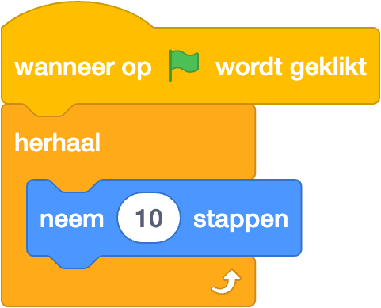

********************************************************************************

::: read

*Introductie*

...
:::

________________________________________________________________________________
<!-- @include: ../lib/explain-mod.md#scratch -->
________________________________________________________________________________
*pagebreak*

:::: program

*Laat de kat lopen*

Voeg de onderstaande blokken toe aan de code van 

::::

________________________________________________________________________________

::: challenge
*Uitdaging*

Probeer eens om .......
::: 

________________________________________________________________________________

::: challenge
*Uitdaging*

Probeer eens om .......
::: 
